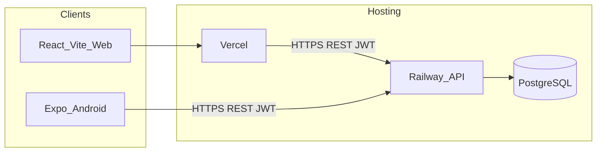
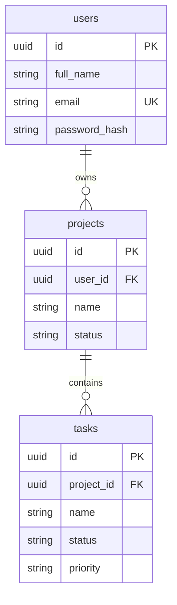

# Phase 0: Architecture and Planning

**Source of truth:** [docs/Intern_Task_Full_Stack_Developer.pdf](Intern_Task_Full_Stack_Developer.pdf). Nothing below invents PDF requirements. Extra items are labeled **Recommendation**.

**Locked decisions:** one public GitHub monorepo; Railway PostgreSQL + Railway API as primary deployment (Render as fallback if Railway is blocked); Vercel for the React web app; Expo for Android; Postman for API testing.

---

## 1–2. Requirements extracted from the PDF

### Mandatory functional

**Authentication (both clients, same account)**
- Register, login, logout; stay logged in until logout or token expiry
- Fields: full name, email, password
- Unique emails; never store plaintext passwords
- One account works on web and mobile

**Projects (web; data must be available to mobile for viewing)**
- Create, view details, edit, delete, list **owned** projects
- Fields: name, description, status (`Not Started` | `In Progress` | `Completed`), start date, end date, created date

**Tasks (nested under projects)**
- Create, edit, delete, mark completed, list tasks under a project
- Fields: name, description, priority (`Low` | `Medium` | `High`), status (`Pending` | `In Progress` | `Completed`), due date, created date

**Dashboard (both clients)**
- Totals for the **authenticated user only**: total projects, total tasks, completed tasks, pending tasks, projects in progress

**Search and filtering**
- Web (and API): search projects by name; search tasks by name; filter projects by status; filter tasks by status and priority
- Mobile (explicit): search tasks and filter by status and priority; view all projects and tasks under each project

**Mobile-specific (mandatory)**
- Same backend/database as web (no second API)
- Register / login / logout; dashboard; view projects + tasks; create/edit/delete tasks; mark complete; change status and priority
- Android required; iOS optional
- Change on one platform appears on the other after refresh (pull-to-refresh on mobile)
- Token in secure device storage (Android Keystore / iOS Keychain), **not** plain local storage
- Expired token → login screen + clear message
- No network → clear message, not crash/blank

**Web technical**
- React **or** Next.js → **we use React + TypeScript**
- Responsive layout, component structure, form validation, loading indicators, error handling, clean UX

**Mobile technical**
- RN Expo **or** Flutter → **we use React Native + Expo + TypeScript**
- Navigation/screens, form validation, loading + pull-to-refresh, error handling, secure token storage, phone-sized UX

**Backend technical**
- Express **or** NestJS → **we use Node.js + Express + TypeScript**
- REST, route organization, middleware, error handling, **logging**, clean structure
- CORS configured for the web app’s domain
- One API for both clients

**Database**
- PostgreSQL **or** MySQL → **PostgreSQL + Prisma**
- Relational, FKs, normalized

**Security (mandatory)**
- bcrypt (or equivalent) password hashing
- Protected APIs require authentication
- Users may only view/modify/delete **their own** projects and tasks (web and mobile)
- Backend validates **all** input (required fields, email, dates, empty strings, enums); appropriate error responses
- JWT + auth middleware + protected routes
- Do not expose sensitive data in responses (no password hashes)
- SQL injection protection via ORM/parameterized queries (no raw user input in SQL)
- Rate limit **authentication** endpoints (e.g. login attempts per IP)

**Minimum REST endpoints (both clients must use these)**
- Auth: `POST /api/auth/register`, `POST /api/auth/login`, `POST /api/auth/logout`, `GET /api/auth/me`
- Projects: `GET/POST /api/projects`, `GET/PUT/DELETE /api/projects/{id}`
- Tasks: `GET/POST /api/tasks`, `GET/PUT/DELETE /api/tasks/{id}`
- Dashboard: `GET /api/dashboard`

**Documentation (mandatory for submission)**
- Setup for backend, web, mobile; env vars; database setup; API docs; how to run mobile against the **deployed** backend; easy for another developer to run

### Optional / bonus (PDF page 7) — skip for two days unless leftover time

Docker, unit/integration tests, pagination, sorting, audit logs, RBAC, CI/CD, refresh tokens, push notifications (due tomorrow), offline mobile viewing, shared types/validation across apps.

### Submission (mandatory)

1. Public GitHub repo (viewable without login) — **one monorepo**
2. Database schema or ER diagram
3. API documentation
4. README
5. Deployment URL for **web** and **backend**
6. Android APK **or** Expo / Firebase App Distribution link
7. ~5-minute screen recording: same account on web + mobile; create a task on one; show it on the other after refresh

**Other PDF notes:** libraries/AI allowed; must be able to explain decisions; readability/maintainability/security matter; not production-ready but good practices; **test data only**.

---

## 3. System architecture



- **Web** and **mobile** are presentation layers only. They share **no** database and **no** second backend.
- Both send `Authorization: Bearer <JWT>` to the same Express API.
- Prisma is the only data access path. Ownership is enforced in the service layer on every read/write, not only in the UI.

**Recommendation:** Vite for the React SPA (fast, simple deploy to Vercel). Do not use Next.js unless SSR is needed (it is not in the PDF).

---

## 4. PostgreSQL data model

Enums (Prisma): `ProjectStatus` = `NOT_STARTED` | `IN_PROGRESS` | `COMPLETED`; `TaskStatus` = `PENDING` | `IN_PROGRESS` | `COMPLETED`; `TaskPriority` = `LOW` | `MEDIUM` | `HIGH`. Map to PDF labels in API responses (`Not Started`, etc.) **or** store display strings — **Recommendation:** store enums as above; map in API DTOs so the DB stays stable.

**users**
- `id` UUID PK
- `full_name` TEXT NOT NULL
- `email` TEXT NOT NULL UNIQUE (case-normalized **Recommendation:** store lowercase)
- `password_hash` TEXT NOT NULL
- `created_at` TIMESTAMPTZ NOT NULL default now()
- **Recommendation:** `updated_at` (not in PDF)

**projects**
- `id` UUID PK
- `user_id` UUID NOT NULL FK → `users.id` **ON DELETE CASCADE**
- `name` TEXT NOT NULL
- `description` TEXT NULL
- `status` `ProjectStatus` NOT NULL
- `start_date` DATE NULL (**Recommendation:** allow null if not required by forms; PDF lists the field — treat as required on create unless we confirm empty allowed; **plan: required** to match “Project Fields”)
- `end_date` DATE NULL (**plan: required**; **Recommendation:** check `end_date >= start_date` in Zod)
- `created_at` TIMESTAMPTZ NOT NULL default now()
- **Recommendation:** `updated_at`

**tasks**
- `id` UUID PK
- `project_id` UUID NOT NULL FK → `projects.id` **ON DELETE CASCADE** (deleting a project deletes its tasks)
- `name` TEXT NOT NULL
- `description` TEXT NULL
- `priority` `TaskPriority` NOT NULL
- `status` `TaskStatus` NOT NULL
- `due_date` DATE NULL (**plan: required** as listed field)
- `created_at` TIMESTAMPTZ NOT NULL default now()
- **Recommendation:** `updated_at`
- **Do not** add `user_id` on tasks unless we denormalize. **Recommendation:** omit `user_id` on tasks; ownership = `task.project.user_id`. Keeps the model normalized (PDF: normalized structure).

**Indexes (useful, not named in PDF — Recommendation)**
- `users.email` unique (already)
- `projects (user_id)`
- `projects (user_id, status)` for dashboard + filter
- `tasks (project_id)`
- `tasks (project_id, status)` and `(project_id, priority)` for filters
- Optional trigram later — skip; use `ILIKE` for name search

**ER (conceptual)**



---

## 5. Ownership / authorization

**Rule from PDF:** a user may only view, modify, and delete **their own** projects and tasks.

**Model**
- A project has exactly one owner: `projects.user_id`.
- A task belongs to a project. Access to a task = access to that project.
- Never trust a client-supplied `userId` for authorization. Set owner from `req.user.id` on create.

**Enforcement (every handler)**
- `GET /api/projects` — `WHERE user_id = req.user.id` (+ search/status)
- `GET/PUT/DELETE /api/projects/:id` — load by id **and** `user_id`; if missing → **404** (Recommendation: do not 403, avoids leaking that another user’s project exists)
- `POST /api/projects` — `user_id = req.user.id`
- `GET /api/tasks` — join project, `project.user_id = req.user.id`; optional `projectId` query still verifies that project is owned
- `GET/PUT/DELETE /api/tasks/:id` — task → project → `user_id` match; else 404
- `POST /api/tasks` — body includes `projectId` (needed because the PDF posts to `/api/tasks`, not nested routes); reject if that project is not owned
- `GET /api/dashboard` — aggregates only for `req.user.id`

UIs must hide others’ data, but **UI is not security**. Backend is the gate.

---

## 6. Backend architecture and folders

**Recommendation** (monorepo):

```text
/
  AGENTS.md
  README.md
  docs/                    # PDF, ER diagram, API docs
  apps/api/                # Express + Prisma
    prisma/schema.prisma
    src/
      index.ts             # bootstrap, listen
      app.ts               # express app, CORS, helmet, json, routes
      config/              # env via Zod
      routes/              # thin: wire path → validators → controller
      controllers/         # HTTP in/out, status codes
      services/            # business rules, ownership checks
      middleware/          # auth JWT, error handler, request log, rate limit
      validators/          # Zod schemas for bodies/params/query
      db/                  # Prisma client singleton
      utils/               # hash, jwt, logger, AppError
  apps/web/                # Vite React TS
  apps/mobile/             # Expo
```

**Responsibilities**
- **routes:** URL map only; attach `authenticate` except public auth register/login
- **controllers:** parse request, call service, send JSON; no Prisma
- **services:** transactions, ownership, aggregates; return domain results or throw `AppError`
- **middleware:** JWT verify → `req.user`; global error formatter; morgan/pino **logging** (PDF required); `express-rate-limit` on `/api/auth/login` and **Recommendation:** also register
- **validators:** Zod; 400 with field errors
- **database layer:** Prisma only; no string-concatenated SQL
- **utilities:** bcrypt, jwt sign/verify, logger
- **configuration:** `DATABASE_URL`, `JWT_SECRET`, `JWT_EXPIRES_IN`, `CORS_ORIGIN`, `PORT`, `NODE_ENV` — fail fast if missing

---

## 7. Web application structure

**Recommendation:** Vite + React + TypeScript + React Router. No Next.js.

```text
apps/web/src/
  api/           # fetch wrappers; attach Bearer token
  auth/          # AuthContext: login, register, logout, persist session
  components/    # layout, forms, loaders, errors
  pages/         # Login, Register, Dashboard, Projects, ProjectDetail, Tasks
  hooks/
  types/
```

**Screens (mandatory coverage)**
- Register, login, logout
- Dashboard with five stats
- Project list + search/filter by status + CRUD
- Project detail with tasks under it
- Task CRUD, mark complete, search/filter by status/priority
- Loading and error states; responsive layout

**Auth storage (web):** PDF mandates Keystore/Keychain **for mobile**, not web. **Recommendation:** `localStorage` for JWT on web (simple cross-origin Vercel → Railway Bearer). Note XSS risk in README. Do not use cookies unless we add credentialed CORS (extra complexity).

---

## 8. Mobile application structure (Expo)

**Android required; skip iOS-specific polish.**

```text
apps/mobile/
  app.json / app.config.ts
  src/
    api/           # same REST paths as web
    auth/          # SecureStore token
    navigation/    # stack: Auth vs App
    screens/       # Login, Register, Dashboard, ProjectList, ProjectTasks, TaskForm
    components/
```

**Must implement:** auth, dashboard, list projects, tasks per project, task create/edit/delete, complete + status/priority, search/filter tasks, pull-to-refresh, expired-token redirect, offline message.

**Do not need on mobile (not in PDF mobile list):** project create/edit/delete, project search/filter. Users create projects on **web**; mobile consumes them. Saves a day of UI.

**Recommendation:** Expo Router or React Navigation stack — pick React Navigation for familiarity and APK simplicity.

---

## 9. REST API mapping

All under `/api`, JSON, JWT except register/login.

| PDF endpoint | Module | Notes |
|---|---|---|
| `POST /api/auth/register` | auth | hash password; unique email → 409 |
| `POST /api/auth/login` | auth | rate limited |
| `POST /api/auth/logout` | auth | authenticated; stateless JWT → 200 and client drops token (**Recommendation:** no blacklist; refresh tokens are bonus) |
| `GET /api/auth/me` | auth | id, fullName, email only |
| `GET /api/projects` | projects | query: `search`, `status` |
| `GET /api/projects/:id` | projects | owner check |
| `POST /api/projects` | projects | |
| `PUT /api/projects/:id` | projects | |
| `DELETE /api/projects/:id` | projects | cascade tasks |
| `GET /api/tasks` | tasks | query: `projectId`, `search`, `status`, `priority` |
| `GET /api/tasks/:id` | tasks | |
| `POST /api/tasks` | tasks | body must include `projectId` |
| `PUT /api/tasks/:id` | tasks | include status/priority; “mark completed” = PUT status |
| `DELETE /api/tasks/:id` | tasks | |
| `GET /api/dashboard` | dashboard | five counts |

**Recommendation:** consistent envelope `{ data }` and `{ error: { message, details? } }`. Not required by PDF.

**CORS:** allow the Vercel web origin (and localhost for dev). Mobile does not use CORS.

---

## 10. Authentication lifecycle

1. **Register:** validate → hash password with bcrypt (cost ~10–12) → insert user → **Recommendation:** return user + JWT so the UI can enter the app
2. **Password hashing:** only `password_hash` stored; responses never include it
3. **Login:** find by normalized email → bcrypt compare → sign JWT `{ sub: userId }` with expiry (Recommendation: 24h or 7d; document it)
4. **JWT creation:** `jsonwebtoken`; secret from env
5. **Authenticated requests:** `Authorization: Bearer`; middleware verifies; attach `req.user`
6. **Logout:** client deletes token (web localStorage / mobile SecureStore). API returns 200. Stateless; old JWT valid until expiry (acceptable for this assessment; PDF lists refresh tokens as bonus)
7. **Expiry:** API 401 `{ message: "Token expired" }` (or generic unauthorized). Clients clear session and show login with a clear message

---

## 11. Mobile token, expiry, offline, refresh

- Store JWT with **`expo-secure-store`** (Android Keystore / iOS Keychain). Never AsyncStorage for the token.
- On 401 from expired/invalid token: delete stored token, reset nav to Login, show “Session expired. Please log in again.”
- On network failure (`fetch` TypeError / timeout): banner or alert “No internet connection.” Keep last screen; do not crash.
- Pull-to-refresh on dashboard, project list, and task list → refetch from API (PDF: other platform’s changes appear after refresh).
- **Skip** offline cache (bonus).

---

## 12. Security considerations (from PDF + labeled extras)

| Topic | From PDF | Plan |
|---|---|---|
| Passwords | bcrypt; never plaintext | bcrypt hash on write; never log passwords |
| JWT | required; protected routes | Bearer; short-ish expiry; secret in env |
| Authorization | own data only | service-layer owner checks; no IDOR |
| Input validation | backend, all requests | Zod; enums, dates, non-empty strings, email |
| SQL injection | ORM / parameterized | Prisma only; no `$queryRaw` with user strings |
| Rate limiting | auth endpoints | `express-rate-limit` on login (and register) |
| CORS | web app domain | explicit origin allowlist |
| Sensitive data | not in responses | strip `password_hash`; no stack traces in prod |

**Recommendation (not PDF):** Helmet; disable `x-powered-by`; do not put JWT in URL query; HTTPS on Railway/Vercel.

---

## 13. Two-day implementation roadmap

Work in small, testable slices. Do not start web/mobile until auth + one resource works in Postman.

**Day 1 — API correctness**
- **P1 Scaffold:** monorepo folders, `apps/api` Express+TS, Prisma, env sample, health route, CORS, logger
- **P2 Schema:** Prisma models, migrate, seed **one test user + sample projects/tasks** (test data only)
- **P3 Auth:** register/login/logout/me, bcrypt, JWT middleware, rate limit, Zod
- **P4 Projects:** CRUD + search/filter + ownership 404s
- **P5 Tasks:** CRUD + complete/status/priority + search/filter + project ownership
- **P6 Dashboard:** five aggregations

**Day 2 — Clients, deploy, evidence**
- **P7 Web:** auth pages, dashboard, projects, tasks, validation, loaders, errors, responsive
- **P8 Mobile:** SecureStore, auth, dashboard, project→tasks, task mutations, search/filter, PTR, offline + expiry UX (no project CRUD)
- **P9 Docs:** README, env, DB setup, API doc, ER diagram (Mermaid in `docs/`), mobile-vs-deployed-API
- **P10 Ship:** Railway Postgres+API (Render fallback), Vercel web (`VITE_API_URL`), Expo EAS APK or distribution link, 5-min recording, public GitHub

If time is short: finish a **demo-complete** path (register → project on web → task on mobile → see on web) before polish.

---

## 14. Decisions to finalize before coding (defaults if you approve this plan)

- Monorepo + Vite React + Expo + Express + Prisma + Zod + bcrypt + JWT REST — **approved stack**
- Railway PostgreSQL + Railway API (Render fallback), Vercel web
- Bearer JWT both clients; web `localStorage`; mobile SecureStore
- Stateless logout (no denylist, no refresh tokens)
- Task `projectId` in POST body; lists filtered via query params
- Enums in DB; DTO maps to PDF labels
- Mobile: no project CRUD
- JWT TTL: **24 hours** unless you specify otherwise
- Prisma `uuid()` PKs
- **Recommendation:** `helmet`, request logging, 404-on-foreign-resource

---

## 15. Do **not** implement in two days (optional / out of mobile scope)

- Docker, CI/CD, pagination, sorting, audit logs, RBAC, refresh tokens, push notifications, offline task viewing, shared monorepo types package, integration/unit test suites
- iOS TestFlight / iOS-only UI
- Nested routes like `/api/projects/:id/tasks` as extra surface (PDF specifies `/api/tasks`)
- Second backend for mobile
- Real personal data
- Project create/edit/delete on **mobile** (not required)

If extra hours remain: a few auth + ownership tests, then pagination.

---

## AGENTS.md (to write after you approve; no app code)

Will add concise rules: purpose (assessment PMS, PDF is source of truth); approved stack; one API one DB; ownership on every query; Zod + Prisma; no plaintext passwords; no bonus features unless asked; do not edit unrelated files; test data only; both clients use listed `/api/*` endpoints.

---

**This phase stops here.** After approval: write `AGENTS.md`, then wait for an explicit implementation go-ahead for P1 (no routes/components/schema until you say to implement).
